# stack-ai-rag

[](https://github.com/kyueran/stack-ai-rag/actions/workflows/ci.yml)

A local-first Retrieval-Augmented Generation (RAG) system for PDF knowledge bases using FastAPI, custom hybrid retrieval (BM25 + semantic cosine), and Mistral for embeddings/generation.

## What this implements

- PDF ingestion endpoint with strict validation, extraction, sentence-aware chunking, and deterministic chunk IDs.
- Query endpoint with:
  - intent routing (`chitchat`, `knowledge_lookup`, `refusal`)
  - query rewriting for retrieval
  - automatic answer shaping (`paragraph`/`list`/`table`) based on query type
  - hybrid retrieval (custom BM25 + semantic search + RRF fusion)
  - citations with evidence threshold enforcement
  - hallucination filtering (post-hoc evidence check)
  - policy controls (PII refusal, legal/medical disclaimers)
- HTMX chat UI for uploading PDFs and chatting with citation-backed answers.
- TF-IDF key concepts visualization panel with document filtering and source-page links.
- SQLite persistence for documents/chunks/terms/embeddings/retrieval logs (no external vector DB).

## Requirements alignment

- FastAPI: yes
- Mistral API: yes (via `MISTRAL_API_KEY`)
- No external library for search/RAG: yes (tokenizer, inverted index, BM25, cosine, fusion implemented in this repo)
- No third-party vector DB: yes (SQLite only)
- Bonus features: yes
  - citation threshold with `insufficient evidence`
  - answer shaping (`paragraph`, `list`, `table`)
  - hallucination/evidence filtering
  - refusal/disclaimer policies

## Architecture



### Data model (SQLite)

- `documents`: document metadata and ingest stats
- `chunks`: chunk text + location metadata
- `terms`: inverted index term frequencies (for BM25)
- `embeddings`: per-chunk embedding vectors (JSON)
- `retrieval_logs`: retrieval diagnostics and top-k outputs

### Retrieval scoring

1. Keyword: custom BM25 over `terms` + `chunks`
2. Semantic: query embedding vs chunk embeddings using cosine similarity
3. Fusion: normalized weighted blend + RRF bonus
4. Deterministic tie-break: fused score -> semantic -> keyword -> chunk ID

## API

### 1) Ingestion

`POST /api/v1/ingest`

- Content type: `multipart/form-data`
- Field: `files` (one or many PDFs)

Response fields include:

- `status`: `ok | partial_success | error`
- `accepted_count`, `rejected_count`
- per-file metadata: `document_id`, `page_count`, `chunk_count`, warnings/errors

### 2) Query

`POST /api/v1/query`

Request:

```json
{
  "query": "What does the architecture say about hallucination filtering?",
  "top_k": 20
}
```

Response includes:

- `status`: `ok | no_search | refused | insufficient_evidence`
- `intent`
- `rewritten_query`
- `answer_format` chosen automatically by query type
- `answer`
- `citations[]` with chunk IDs/pages/scores
- `unsupported_claims[]` from post-hoc evidence checking
- `refusal_reason` / `disclaimer` when applicable

### 3) Concepts

`GET /api/v1/concepts?document_id=<optional>&top_n=30`

- Returns TF-IDF-ranked concepts from ingested documents.
- Includes evidence links (chunk IDs + page metadata) to trace why each concept is important.
- `document_id` filter scopes concepts to one document while still using global document frequency (`df`).

### 4) UI and health

- `GET /` HTMX chat UI
- `GET /ui/concepts` concepts panel partial (used by HTMX)
- `GET /healthz` service liveness

## Run locally

1. Create and activate environment

```bash
python3 -m venv .venv
source .venv/bin/activate
```

2. Install

```bash
# required for editable pyproject installs on older virtualenv pip versions
python3 -m pip install --upgrade pip
python3 -m pip install -e '.[dev]'
```

3. Configure

```bash
cp .env.example .env
# set MISTRAL_API_KEY in .env
```

4. Start API/UI

```bash
make run
```

5. Open UI

- http://localhost:8000/

## Quality gates

```bash
ruff check .
mypy app tests
pytest
```

## Library and software links

- FastAPI: https://fastapi.tiangolo.com/
- Pydantic: https://docs.pydantic.dev/
- HTMX: https://htmx.org/
- PyPDF: https://pypdf.readthedocs.io/
- Mistral docs: https://docs.mistral.ai/
- Uvicorn: https://www.uvicorn.org/
- SQLite: https://www.sqlite.org/

## Security considerations

- Strict upload constraints: count, size, extension, MIME, PDF magic-byte signature, page limits.
- PII refusal policy for sensitive personal data requests.
- Legal/medical disclaimer injection.
- Evidence threshold guard to avoid unsupported confident answers.
- Atomic ingestion writes to prevent partial DB corruption.

## Scalability notes

- SQLite is sufficient for local/small deployments; move to PostgreSQL for concurrent multi-writer workloads.
- Embeddings are stored locally; can be sharded by document namespace if dataset grows.
- Retrieval logs are persisted for offline tuning and quality monitoring.
- Chunking and embeddings can be moved to async background workers for high-throughput ingestion.

## Chunking and extraction design notes

See [docs/ingestion.md](docs/ingestion.md) for detailed tradeoffs around chunk size/overlap, table-heavy PDFs, headers/footers, and scanned documents.
